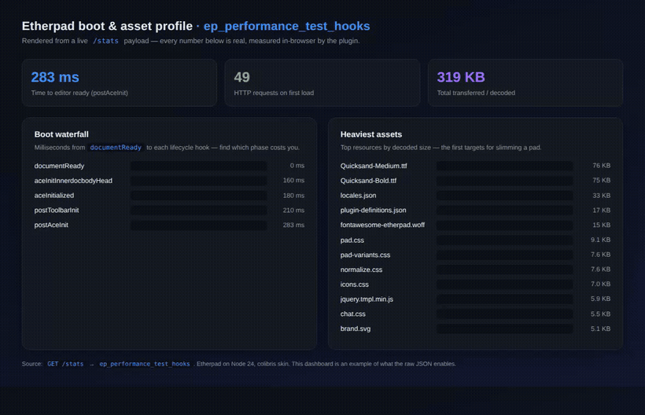
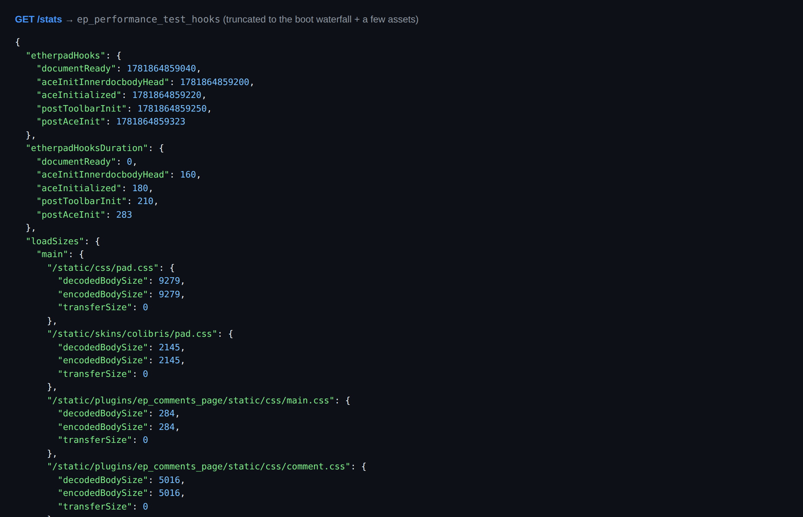
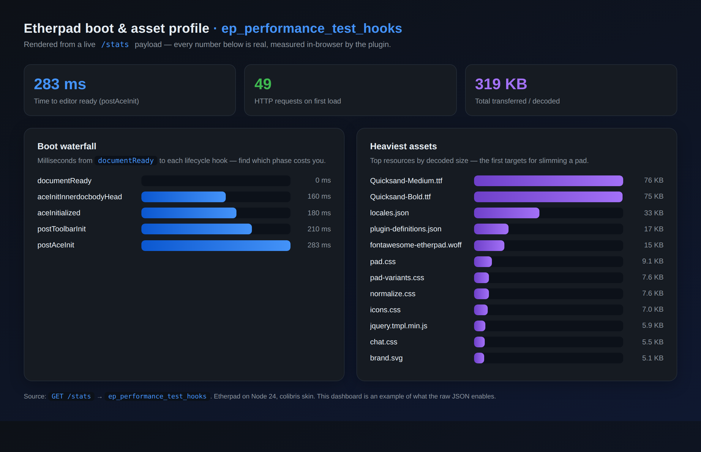

 [](https://github.com/ether/ep_performance_test_hooks/actions/workflows/test-and-release.yml)

# Performance Test Hooks for Etherpad

**See exactly how long your Etherpad takes to become editable — and which assets weigh it down — straight from the browser, with no external APM.**

This plugin instruments the client lifecycle: it times every Etherpad boot hook (`documentReady` → `postAceInit`) and records the load time and byte size of every resource the pad, outer frame, and inner editor request. The data is exposed as JSON at `/stats`, ready to graph, alert on, or diff between releases.



> The dashboard above is rendered entirely from one real `/stats` response — every number is measured in-browser by the plugin.

## Why you'd want it

- **Find the slow phase of pad load.** The boot waterfall shows the cost of each lifecycle stage, so you know whether time goes to the editor, the toolbar, or plugin init — not just a single opaque "load time".
- **Catch asset bloat before users do.** Per-resource decoded/encoded/transfer sizes make it obvious when a font, locale bundle, or plugin asset balloons.
- **Spot regressions across releases.** `/stats` is plain JSON, so you can snapshot it in CI and fail the build when boot time or payload size creeps up.
- **No third-party APM.** Everything is collected with the browser's own `PerformanceResourceTiming` API and stays on your server.

## What it looks like

A single `GET /stats` returns the raw timings under the `ep_performance_test_hooks` key:



Turn that JSON into whatever you need — here it is as a simple at-a-glance dashboard:



## What's measured

| Field | What it tells you |
| --- | --- |
| `etherpadHooks` | Wall-clock timestamp each lifecycle hook fired |
| `etherpadHooksDuration` | Milliseconds from `documentReady` to each hook — the **boot waterfall** |
| `loadTimes.{main,outer,inner}` | Redirect / DNS / TCP / TLS / response timings per resource, for each of the three pad frames |
| `loadSizes.{main,outer,inner}` | `decodedBodySize` / `encodedBodySize` / `transferSize` per resource |
| `performance` | The page's `navigation` PerformanceEntry |

## Usage

Open any pad (this is what populates the metrics), then read the collected stats at:

```
GET /stats
```

The plugin's data lives under `stats.ep_performance_test_hooks`. Poll it, render it, or diff it between deploys — for example, fail CI if `etherpadHooksDuration.postAceInit` exceeds a budget:

```sh
curl -s http://localhost:9001/stats \
  | jq '.ep_performance_test_hooks.etherpadHooksDuration.postAceInit'
```

> The dashboard images above are an example visualization; the plugin ships the data, you choose how to display it.

## Installation

Install from the Etherpad admin UI (**Admin → Manage Plugins**,
search for `ep_performance_test_hooks` and click *Install*), or from the Etherpad
root directory:

```sh
pnpm run plugins install ep_performance_test_hooks
```

> ⚠️ Don't run `npm i` / `npm install` yourself from the Etherpad
> source tree — Etherpad tracks installed plugins through its own
> plugin-manager, and hand-editing `package.json` can leave the
> server unable to start.

After installing, restart Etherpad.
